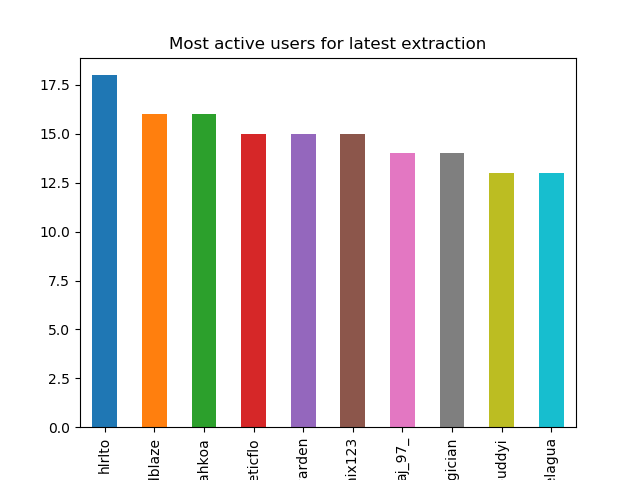

# Twitch chat data analysis

This command-line application shows real-time stats of any streamer live on Twitch. It then parses the extracted data into dataframes for additional data analysis.

## Demo

xQcOW is a popular streamer on Twitch with hundreds of thousands of followers. The tool can extract the chat:

The tool can then run analysis on the chat data:

## Usage 

Install the required packages with 
<code>pip install -r requirements.txt</code>

Run <code>python extract.py [insert-streamer-name-in-lowercase-characters]</code> while the streamer is live to extract the live chat. Use ctrl-c to exit.

Run <code>python analysis.py [your-streamer-here]</code> after the extraction for graphs and stuff. 

You can check the chat logs under 'logs' and it is recommended to clear the logs everytime a new extraction is initiated. 
